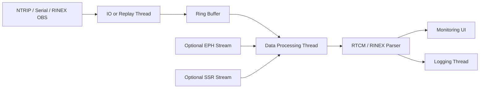

# RTGS - Real-Time GNSS Studio

RTGS is a desktop workbench for real-time GNSS data acquisition, signal quality monitoring, positioning, and environmental analysis. The application uses a PySide6 GUI on top of reusable GNSS processing modules for NTRIP, serial receiver input, RINEX replay, RTCM decoding, live visualization, and standards-oriented data export.

<p align="center">
  
</p>

## Project Status

| Module | Status | Notes |
| --- | --- | --- |
| Signal Quality Monitoring | Completed | Primary delivered module. Supports live/replay input, satellite visualization, SNR/CNR monitoring, OBS/EPH/SSR status, and data logging. |
| Precise Positioning | In progress | Live SPP/PPP plus single-base and VRS/FKP/MAC network RTK workflows. |
| GNSS-Reflectometry | In progress | Integrated GNSS-IR workbench with real-time and batch-oriented analysis components. |
| GNSS-Refractometry | Planned | Placeholder workbench for ZTD, PWV, ionospheric, and gradient products. |
| RTCM Batch Converter | Completed | Standalone folder converter with constellation/observation filtering, sampling, and time-based RINEX splitting. |

## Features

- Unified launcher for Monitoring, Positioning, Reflectometry, and Refractometry workbenches.
- Real-time monitoring from NTRIP Server, serial receiver, or RINEX replay sources.
- Primary OBS stream support with optional broadcast ephemeris and SSR correction streams.
- Single-base and network RTK with ambiguity resolution, multi-GNSS input, VRS GGA requests, and FIX/FLOAT quality display.
- Live skyplot, satellite count trend, multi-signal SNR overview, per-system observation tables, and runtime log output.
- Recording to CSV, raw binary RTCM, RINEX OBS, RINEX NAV, and SP3-style precise output when the required source data is available.
- YAML-based configuration for stream sources and GNSS-IR settings.
- Utility scripts for RTCM/Unicore-to-RINEX conversion, multi-station real-time NTRIP-to-RINEX capture, and RINEX splitting/merging.
- Standalone `rtcm_batch_gui.py` for converting folders of RTCM/Unicore files with configurable multi-process decoding.

## Quick Start

Python 3.10 or newer is recommended.

```powershell
python -m venv .venv
.\.venv\Scripts\Activate.ps1
python -m pip install -r requirements.txt
python gui_main.py
# Or launch the independent batch converter:
python rtcm_batch_gui.py
```

After the launcher opens, select a real-time workbench. The batch converter is intentionally independent and is started with `python rtcm_batch_gui.py`. See [doc/USAGE.md](doc/USAGE.md) for a concise screenshot-based user guide.

RTK mode requires an `rtkrcv` executable. RTGS searches `PATH`,
`RTGS_RTKRCV`, `RTK_ENGINE_RTKRCV`, and `bin/rtkrcv`.

## Common Commands

| Command | Description |
| --- | --- |
| `python gui_main.py` | Start the desktop application. |
| `python -m pytest` | Run the test suite. |
| `python utils/rtcm_to_rinex.py <input> --output <dir> --site <SITE>` | Convert an RTCM/Unicore observation stream file to RINEX observation output. |
| `python rtcm_batch_gui.py` | Batch-convert a folder with selected G/R/E/C systems, C/L/D/S observations, split duration, and output sampling interval. |
| `python utils/rt_ntrip_to_rinex.py config/streams/rt_multi_ntrip_rinex.yaml` | Run the YAML-driven multi-station NTRIP-to-RINEX service. |

## Project Layout

| Path | Purpose |
| --- | --- |
| `gui_main.py` | Application entry point. |
| `ui/` | PySide6 windows, dialogs, plotting widgets, and module-level orchestration. |
| `ui/monitoring/` | Completed real-time signal quality monitoring module. |
| `ui/rtcm_batch_converter.py` | Independent PySide6 batch conversion window and worker. |
| `core/` | GNSS data models, RTCM parsing, RINEX writing, stream services, positioning, and reflectometry core logic. |
| `config/streams/` | Stream configuration examples and station-specific YAML files. |
| `config/ir/` | GNSS-IR configuration files. |
| `utils/` | Command-line tools and service wrappers around the core processing logic. |
| `utils/rtcm_batch_converter.py` | Reusable folder conversion service used by the standalone GUI. |
| `tests/` | Tests for RTCM, RINEX, replay, positioning, and reflectometry behavior. |
| `assets/` | Project logo and documentation screenshots. |
| `doc/` | User documentation and external protocol/device reference PDFs. |

## Monitoring Data Flow



The monitoring module separates data acquisition, parsing, UI refresh, and file recording so the GUI remains responsive while real-time GNSS data is arriving.

## Configuration

- Use the **Config** button in the monitoring module for interactive stream setup.
- Use `config/streams/example_config.yaml` as the reference for stream fields.
- OBS is the primary observation stream. EPH and SSR are optional and should be enabled only when the corresponding data source is available.
- Remove private NTRIP credentials, receiver passwords, station secrets, and site-specific access tokens before sharing configuration files.

## Development Notes

- Keep reusable GNSS processing logic in `core/`; keep GUI orchestration and interaction logic in `ui/`.
- Add or update tests when changing RTCM parsing, RINEX output, stream configuration, replay behavior, or data contracts.
- Keep runtime outputs, logs, build artifacts, and virtual environments in ignored folders such as `output/`, `log/`, `build/`, and `.venv/`.
- External protocol and receiver manuals remain in `doc/` as PDF references. Temporary implementation reports and fix summaries should be consolidated into the README or focused user documentation instead of accumulating as standalone Markdown files.

## Documentation

- [Monitoring user guide](doc/USAGE.md)
- PDF files in `doc/` are external references for RTCM, RINEX, and receiver-specific documentation.
