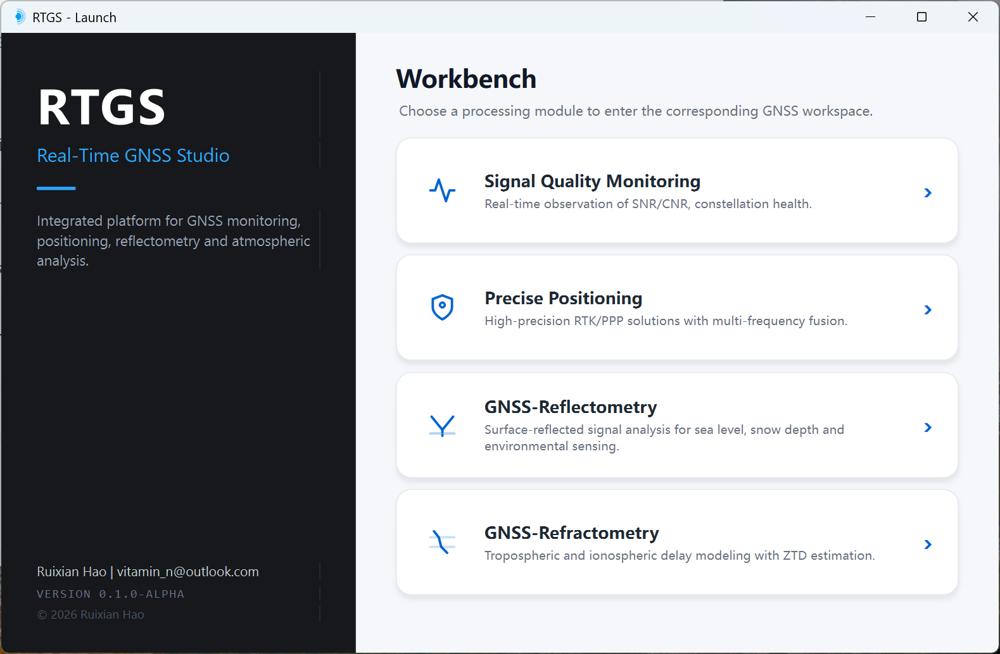
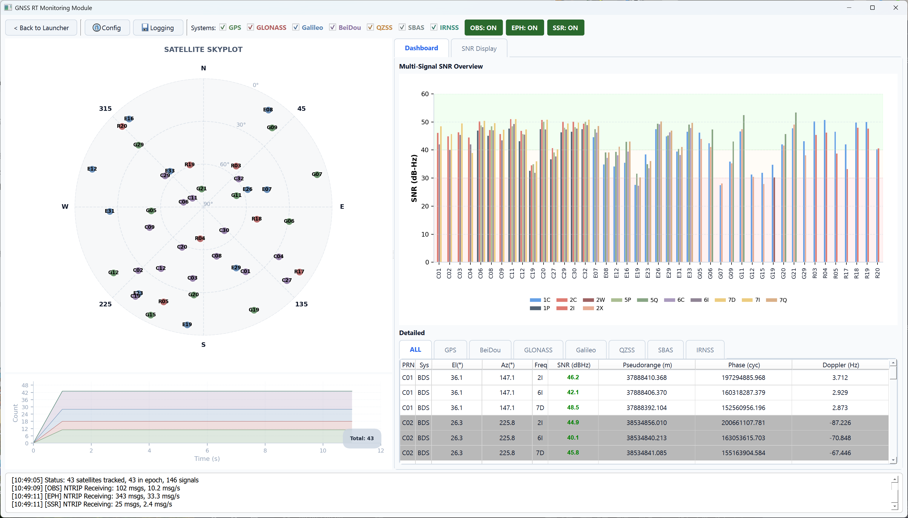
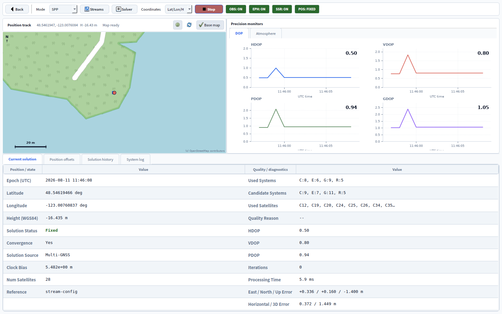

# RTGS - Real-Time GNSS Studio

RTGS is a desktop workbench for real-time GNSS data acquisition, signal quality monitoring, positioning, and environmental analysis. The application uses a PySide6 GUI on top of reusable GNSS processing modules for NTRIP, serial receiver input, RINEX replay, RTCM decoding, live visualization, and standards-oriented data export.

## Application Launcher

<p align="center">
  
</p>

## Signal Quality Monitoring

The monitoring workbench combines live stream state, satellite geometry, signal
quality trends, per-system observations, and recording controls. See the
[monitoring user guide](doc/USAGE.md) for the complete workflow.

<p align="center">
  
</p>

## Precise Positioning

The positioning workbench supports multi-GNSS SPP and PPP together with native
single-base and network RTK workflows. See the
[positioning user guide](doc/POSITIONING.md) for stream, solver, and result details.

<p align="center">
  
</p>

## Project Status

| Module | Status | Notes |
| --- | --- | --- |
| Signal Quality Monitoring | Completed | Primary delivered module. Supports live/replay input, satellite visualization, SNR/CNR monitoring, OBS/EPH/SSR status, and data logging. |
| Precise Positioning | In progress | Live multi-GNSS SPP and PPP, plus single-base and VRS/FKP/MAC network RTK workflows. |
| GNSS-Reflectometry | In progress | Integrated real-time and RINEX batch GNSS-IR analysis, including EKF product generation. |
| GNSS-Refractometry | Planned | Placeholder workbench for ZTD, PWV, ionospheric, and gradient products. |
| RTCM Batch Converter | Completed | Standalone folder converter with constellation/observation filtering, sampling, and time-based RINEX splitting. |

## Recent Changes

- Added multi-GNSS SPP and configurable PPP with ionosphere-free or uncombined observations, SSR orbit/clock and phase-bias support, ambiguity resolution, troposphere estimates, and precise physical corrections.
- Bundled IGS20 ANTEX and multi-station BLQ model data as PPP fallbacks; explicitly configured model files still take precedence.
- Added native single-base and network RTK integration through `rtkrcv`, including VRS/FKP/MAC correction streams and GGA handling.
- Added installable package metadata, `rtgs`/`rtgs-rtcm-batch` entry points, centralized logging, layered tests, CI quality gates, and wheel verification.

## Features

- Unified launcher for Monitoring, Positioning, Reflectometry, and Refractometry workbenches.
- Real-time monitoring from NTRIP Server, serial receiver, or RINEX replay sources.
- Primary OBS stream support with optional broadcast ephemeris and SSR correction streams.
- Multi-GNSS SPP and configurable PPP for live streams or RINEX replay, with position, DOP, atmosphere, offset, and solution-history views.
- Single-base and network RTK with ambiguity resolution, multi-GNSS input, VRS GGA requests, and FIX/FLOAT quality display.
- Live skyplot, satellite count trend, multi-signal SNR overview, per-system observation tables, and runtime log output.
- Recording to CSV, raw binary RTCM, RINEX OBS, RINEX NAV, and SP3-style precise output when the required source data is available.
- YAML-based configuration for stream sources, positioning, and GNSS-IR settings.
- Utility scripts for RTCM/Unicore-to-RINEX conversion and RINEX splitting/merging.
- Standalone `rtcm_batch_gui.py` for converting folders of RTCM/Unicore files with configurable multi-process decoding.

## Quick Start

Python 3.10 or newer is recommended.

```powershell
python -m venv .venv
.\.venv\Scripts\Activate.ps1
python -m pip install -e ".[dev,maps]"
python gui_main.py
# Or launch the independent batch converter:
python rtcm_batch_gui.py
```

The compatibility command `python -m pip install -r requirements.txt` installs the
same editable development environment. After installation, `rtgs` and
`rtgs-rtcm-batch` are also available as GUI commands. See
[doc/USAGE.md](doc/USAGE.md) and [doc/POSITIONING.md](doc/POSITIONING.md) for
screenshot-based user guides.

RTK mode requires an `rtkrcv` executable. RTGS searches `PATH`,
`RTGS_RTKRCV`, `RTK_ENGINE_RTKRCV`, and `bin/rtkrcv`.

PPP uses the model data under `core/resources/ppp/` when the ANTEX or BLQ path is
left empty. Receiver antenna corrections still require a matching antenna descriptor,
and ocean loading requires a station ID present in the BLQ catalog.

## Common Commands

| Command | Description |
| --- | --- |
| `python gui_main.py` | Start the desktop application. |
| `rtgs` | Start the installed desktop application. |
| `python -m pytest` | Run the test suite. |
| `python -m build` | Build the source distribution and wheel. |
| `python scripts/verify_wheel.py dist/<wheel>.whl` | Verify wheel contents and credential safety. |
| `python utils/rtcm_to_rinex.py <input> --output <dir> --site <SITE>` | Convert an RTCM/Unicore observation stream file to RINEX observation output. |
| `python rtcm_batch_gui.py` | Batch-convert a folder with selected G/R/E/C systems, C/L/D/S observations, split duration, and output sampling interval. |
| `rtgs-rtcm-batch` | Start the installed batch converter. |
| `python utils/split_rinex_hourly.py --help` | Inspect RINEX hourly splitting options. |
| `python utils/merge_rinex_daily.py --help` | Inspect RINEX daily merging and resampling options. |

## Project Layout

| Path | Purpose |
| --- | --- |
| `gui_main.py` | Application entry point. |
| `src/rtgs/` | Installable package metadata and shared infrastructure. |
| `ui/` | PySide6 windows, dialogs, plotting widgets, and module-level orchestration. |
| `ui/monitoring/` | Completed real-time signal quality monitoring module. |
| `ui/rtcm_batch_converter.py` | Independent PySide6 batch conversion window and worker. |
| `core/` | GNSS data models, RTCM parsing, RINEX writing, stream services, positioning, and reflectometry core logic. |
| `core/resources/ppp/` | Read-only ANTEX and BLQ fallback data used by PPP. |
| `config/streams/` | Stream configuration examples and station-specific YAML files. |
| `config/ir/` | GNSS-IR configuration files. |
| `utils/` | Command-line tools and service wrappers around the core processing logic. |
| `utils/rtcm_batch_converter.py` | Reusable folder conversion service used by the standalone GUI. |
| `tests/` | Unit, integration, regression, and domain-focused test suites. |
| `scripts/` | Release and repository verification tools. |
| `.github/workflows/ci.yml` | Ruff, Black, mypy, Python 3.10/3.13 tests, and package verification. |
| `assets/` | Project logo and documentation screenshots. |
| `doc/` | User documentation and external protocol/device reference PDFs. |

## Configuration

- Use the **Config** button in the monitoring module for interactive stream setup.
- In a source checkout, RTGS uses the repository `config/` directory. Use
  `config/streams/example_config.yaml` as the credential-free field reference.
- Set `RTGS_CONFIG_DIR` to use an explicit configuration directory. Outside a source
  checkout, RTGS creates credential-free defaults under `%APPDATA%/RTGS` on Windows,
  `~/Library/Application Support/RTGS` on macOS, and `$XDG_CONFIG_HOME/rtgs` or
  `~/.config/rtgs` on Linux.
- OBS is the primary observation stream. EPH and SSR are optional and should be enabled only when the corresponding data source is available.
- RTK additionally requires an enabled base or network correction stream. PPP can use
  the optional SSR stream and falls back to float PPP when compatible phase biases are unavailable.
- Never commit NTRIP credentials, receiver passwords, station secrets, or site-specific
  access tokens. Release wheels are checked for credential-bearing YAML resources.

## Development Notes

- Keep reusable GNSS processing logic in `core/`; keep GUI orchestration and interaction logic in `ui/`.
- Add or update tests when changing RTCM parsing, RINEX output, stream configuration, replay behavior, or data contracts.
- Run `ruff check .`, `black --check .`, `mypy`, and `pytest -q` before release; CI runs
  the same checks and tests Python 3.10 and 3.13.
- Keep runtime outputs, logs, build artifacts, and virtual environments in ignored folders such as `output/`, `log/`, `build/`, and `.venv/`.
- External protocol and receiver manuals remain in `doc/` as PDF references. Temporary implementation reports and fix summaries should be consolidated into the README or focused user documentation instead of accumulating as standalone Markdown files.

## Documentation

- [Monitoring user guide](doc/USAGE.md)
- [Positioning user guide](doc/POSITIONING.md)
- PDF files in `doc/` are external references for RTCM, RINEX, and receiver-specific documentation.
