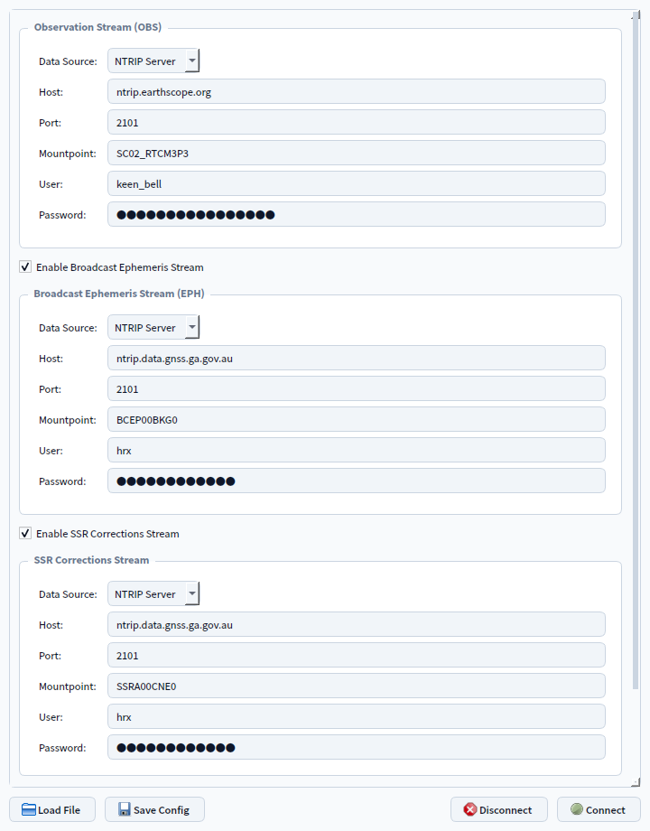
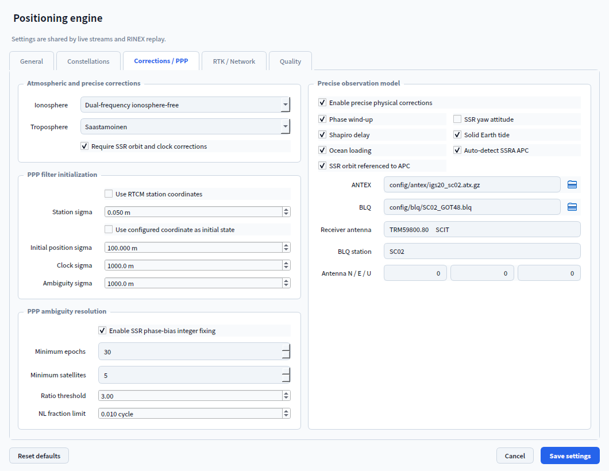

# RTGS User Guide: Precise Positioning

This guide covers the RTGS **Precise Positioning** workbench. It explains how to
configure observation and correction sources, select SPP, PPP, or RTK, tune the
solver, start processing, and interpret the resulting quality indicators.

The positioning module is under active validation. Confirm antenna metadata,
reference coordinates, correction products, and solution quality before using its
output for surveying or operational decisions.

## 1. Start the Application

Run RTGS from the project root:

```powershell
python gui_main.py
```

An editable installation also provides the `rtgs` command. Select **Precise
Positioning** from the launcher.

## 2. Understand the Positioning Workbench

The toolbar controls the positioning mode, stream configuration, solver settings,
coordinate display, and processing state. The upper workspace combines a position
track with DOP or atmosphere monitors. The lower tabs show the current solution,
position offsets, solution history, and system log.

<p align="center">
  
</p>

The screenshot shows a live multi-GNSS SPP session loaded from
`config/streams/SC02.yaml`, including the OpenStreetMap base layer, stream state,
DOP history, and solution diagnostics. It is a documentation snapshot rather than
a surveyed accuracy claim.

Main controls and views:

- **Mode** selects SPP, PPP, or RTK.
- **Streams** configures OBS, EPH, SSR, and RTK base or network inputs.
- **Solver** opens the shared positioning-engine settings.
- **Coordinates** switches position-oriented views between latitude/longitude/height
  and ECEF XYZ.
- **Start** begins both stream processing and positioning for the selected mode.
- **OBS**, **EPH**, and **SSR/BASE** report input availability; **POS** reports the
  current solution state.
- **DOP** and **Atmosphere** show precision geometry and PPP troposphere estimates.
- **Current solution**, **Position offsets**, **Solution history**, and **System log**
  provide detailed diagnostics.

## 3. Configure Data Sources

Click **Streams**. You can enter settings manually or click **Load File** and select a
YAML file. The screenshot below uses `config/streams/SC02.yaml`.

<p align="center">
  
</p>

SC02 provides populated NTRIP sources for OBS, broadcast EPH, and SSR corrections.
Password fields remain masked in the interface and are not reproduced in this guide.

Available streams:

| Stream | Required for | Supported sources | Purpose |
| --- | --- | --- | --- |
| OBS | SPP, PPP, RTK | NTRIP, serial, RINEX observation file | Rover code, phase, Doppler, and signal-strength observations. |
| EPH | SPP and PPP when navigation data is not carried by OBS | NTRIP, serial, broadcast RINEX, precise SP3 | Satellite orbit and clock information. |
| SSR | Corrected SPP and PPP | NTRIP or serial | Orbit, clock, code-bias, phase-bias, and related SSR corrections. |
| BASE | RTK | NTRIP or serial | Single-base observations or VRS/FKP/MAC network corrections. |

Use **Connect** to apply the settings and start only the configured SPP/PPP input
streams. Positioning does not begin until **Start** is pressed. In RTK mode, the native
engine owns its input streams, so they connect when RTK positioning starts.

Use `config/streams/example_config.yaml` as the credential-free field reference when
creating a configuration for distribution. Do not expose NTRIP passwords or private
station details in documentation, logs, or shared screenshots.

### RINEX replay example

For offline SPP or PPP, configure both the observation file and an ephemeris product:

```yaml
obs_settings:
  source_type: RINEX File
  file_path: data/rover.obs
  replay_speed: 1.0

eph_settings:
  enabled: true
  source_type: File
  file_path: data/brdc.nav
  file_type: Broadcast RINEX
```

Set `file_type` to `Precise SP3` when the selected ephemeris file is an SP3 product.
At high replay speeds, RTGS automatically reduces GUI refresh frequency so processing
can continue without making the window unresponsive.

## 4. Choose a Positioning Mode

| Mode | Input requirements | Important behavior |
| --- | --- | --- |
| SPP | OBS plus usable broadcast ephemeris | Multi-GNSS code solution with configurable ionosphere, troposphere, weighting, and quality limits. |
| PPP | Dual-frequency OBS plus ephemeris; SSR according to solver policy | Stateful code-and-phase filter using IFLC or uncombined observations, optional SSR corrections, physical models, troposphere estimation, and PPP ambiguity resolution. |
| RTK | Rover OBS plus an enabled BASE stream | Native `rtkrcv` single-base or VRS/FKP/MAC network solution with FIX/FLOAT quality, correction age, and ambiguity ratio. |

Changing the mode while processing is active stops the current run. Review the
stream and solver configuration before pressing **Start** again.

### RTK engine requirement

RTK requires an executable `rtkrcv`. RTGS searches the following locations in order:

1. An explicitly configured RTK engine path.
2. `RTGS_RTKRCV` or `RTK_ENGINE_RTKRCV`.
3. The system `PATH`.
4. `bin/rtkrcv` or the platform-specific `bin/` directory.

For network RTK, configure the correction mountpoint under **BASE**, choose VRS, FKP,
or MAC under **Solver > RTK / Network**, and verify the GGA position policy.

## 5. Configure the Solver

Click **Solver** to open the tabbed positioning settings dialog.

<p align="center">
  
</p>

This SC02 example populates the station-specific ANTEX and BLQ paths, receiver
antenna descriptor, and BLQ station identifier used by the precise observation
model.

The tabs group related controls:

- **General** sets the elevation cutoff, minimum satellite count, PDOP limit,
  observation weighting, and smoothing behavior.
- **Constellations** enables GPS, GLONASS, Galileo, BeiDou, QZSS, and NavIC and
  controls GPS-only preference or fallback behavior.
- **Corrections / PPP** selects atmospheric corrections, PPP initialization,
  SSR requirements, ambiguity-resolution thresholds, and precise physical models.
- **RTK / Network** selects single-base or network operation, rover dynamics,
  frequencies, ambiguity-resolution behavior, base coordinates, GGA policy, and
  maximum correction age.
- **Quality** controls solution classification and validation thresholds.

### PPP model resources

When the ANTEX and BLQ fields are empty, RTGS uses the read-only resources under
`core/resources/ppp/`:

- the bundled IGS20 ANTEX catalog for supported satellite and receiver antenna
  calibrations;
- the bundled multi-station BLQ catalog for ocean-loading coefficients.

A configured file always overrides the bundled fallback. Receiver antenna correction
still requires a matching configured antenna name or RTCM 1007/1008/1033 descriptor.
Ocean loading is applied only when **BLQ station** matches a catalog record.

PPP ambiguity fixing also requires integer-compatible SSR phase biases. When those
biases are absent or validation thresholds are not met, the solver remains in float
PPP instead of forcing an integer fix.

## 6. Start and Monitor Positioning

Before starting:

1. Select the required mode.
2. Load or enter stream settings and confirm that optional streams are enabled only
   when valid data is available.
3. Review solver settings, especially SSR policy for PPP and BASE/GGA settings for
   RTK.
4. Select latitude/longitude/height or ECEF XYZ display.
5. Press **Start** and watch the stream badges and **System log**.

Interpret the status indicators as follows:

| Indicator | Meaning |
| --- | --- |
| `OBS: ON` | Observation data is active. |
| `EPH: ON` | A separate ephemeris source is active. It may remain off when navigation data arrives through OBS. |
| `SSR: ON` | SSR corrections are active for SPP/PPP. |
| `BASE: ON` | The base or network correction stream is active in RTK mode. |
| `POS: FIXED` | PPP ambiguity resolution or native RTK reports a fixed solution; SPP uses its configured covariance quality threshold. |
| `POS: UNFIXED` | A usable float, differential, or quality-limited solution is available. |
| `POS: NO FIX` | The solver cannot currently produce a usable position. |

Do not judge solution quality from the status badge alone. Check satellite usage,
DOP, residuals, correction age, ambiguity ratio, convergence, and the system log.

## 7. Inspect Results

- **Position track** shows horizontal movement in latitude/longitude mode or coordinate
  changes in ECEF mode. The follow control keeps the newest solution in view.
- **DOP** plots HDOP, VDOP, PDOP, and GDOP over time.
- **Atmosphere** plots PPP ZTD, ZHD, and ZWD estimates. SPP and RTK do not normally
  populate these filter states.
- **Current solution** lists coordinates, epoch, status, used systems and satellites,
  quality reason, DOP, processing time, and mode-specific diagnostics.
- **Position offsets** shows errors when a reference coordinate is available and
  offsets from the first valid solution otherwise.
- **Solution history** provides a compact chronological table for comparison.
- **System log** records connections, decoding state, solver decisions, model-resource
  status, fallbacks, and errors.

## 8. Recommended Workflows

### Live SPP or PPP

1. Configure OBS and ensure broadcast ephemeris is available through OBS or EPH.
2. Enable SSR only when the caster provides corrections compatible with the selected
   constellations and signals.
3. Select SPP for a rapid code solution or PPP for stateful code-and-phase processing.
4. Press **Start**, confirm the active stream badges, and monitor convergence.
5. For PPP, allow sufficient uninterrupted data for the filter and ambiguities to
   stabilize.

### RINEX post-processing replay

1. Set OBS to **RINEX File** and select the observation file.
2. Enable EPH, choose **File**, and select broadcast RINEX or precise SP3.
3. Choose the replay speed and whether only final products are required.
4. Select SPP or PPP, press **Start**, and inspect the log for header, time-system,
   ephemeris, and observation compatibility warnings.

### Single-base or network RTK

1. Configure rover OBS and enable the BASE stream.
2. Select RTK and configure single-base or VRS/FKP/MAC behavior under **Solver**.
3. Verify `rtkrcv` availability and the rover/base data formats.
4. Press **Start** and monitor BASE status, differential age, ambiguity ratio, and the
   native RTK quality label.

## 9. Troubleshooting

| Symptom | Recommendation |
| --- | --- |
| OBS stays off | Check the source type, host, port, mountpoint, serial device, file path, credentials, and whether another process owns the serial port. |
| EPH stays off | Confirm the separate stream is enabled and carries supported navigation messages, or verify the selected RINEX/SP3 file. EPH may remain off when navigation data is embedded in OBS. |
| PPP reports missing SSR corrections | Disable **Require SSR orbit and clock corrections** only when broadcast fallback is intentional, or configure a compatible SSR stream. |
| PPP remains unfixed | Check dual-frequency phase availability, cycle slips, SSR phase biases, satellite count, elevation mask, residual limits, and convergence time. Float PPP is expected when integer-compatible biases are unavailable. |
| ANTEX or BLQ warning appears | Confirm the receiver antenna descriptor and BLQ station ID, or select appropriate external model files. |
| RTK cannot start | Install `rtkrcv`, set `RTGS_RTKRCV`, and verify the rover and BASE formats and mountpoints. |
| RTK remains float | Check base/network latency, correction age, ambiguity ratio, common satellites, frequencies, antenna metadata, and base coordinates. |
| The track or tables stop refreshing during fast replay | Check **Final products only** and replay speed. RTGS intentionally throttles visual updates for high-rate replay. |
| Position errors are unexpectedly large | Verify the coordinate frame, ephemeris source, time system, antenna metadata, approximate/reference coordinate, and enabled constellations. |
