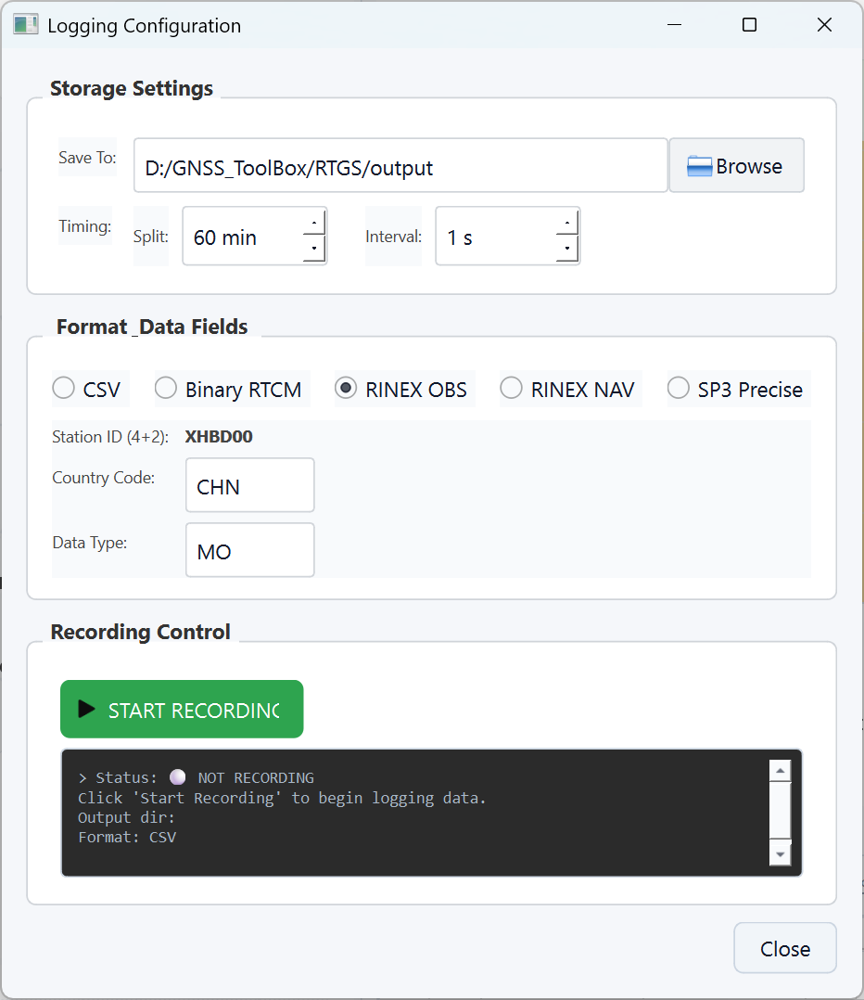

# RTGS User Guide: Signal Quality Monitoring

This guide covers the completed **Signal Quality Monitoring** module. It explains how to start RTGS, configure data sources, inspect monitoring status, and record observation data.

## 1. Start the Application

Run the application from the project root:

```powershell
python gui_main.py
```

The launcher displays four workbench entries. The completed production workflow is **Signal Quality Monitoring**.


## 2. Open the Monitoring Workbench

Select **Signal Quality Monitoring** to open the real-time monitoring window. The top toolbar provides navigation, data source configuration, logging configuration, GNSS system filters, and OBS/EPH/SSR status indicators.


Main areas:

- Left panel: satellite skyplot and satellite count trend.
- Dashboard tab: multi-signal SNR overview and detailed observation table.
- SNR Display tab: per-satellite or per-signal SNR analysis.
- Bottom panel: runtime log for connection, decoding, recording, and error messages.

## 3. Configure Data Sources

Click **Config** in the top toolbar to configure stream input.

OBS is the required primary observation stream. It supports the following sources:

- **NTRIP Server**: enter Host, Port, Mountpoint, User, and Password.
- **Serial Port**: select serial port, baud rate, data bits, stop bits, parity, and flow control.
- **RINEX File**: select a local RINEX observation file and set the replay speed.

Optional streams:

- **Broadcast Ephemeris Stream (EPH)**: enable when broadcast ephemeris data comes from a separate NTRIP, serial, or file source.
- **SSR Corrections Stream**: enable when SSR correction data is available.

After saving the configuration, the module restarts the stream pipeline. **OBS: ON** means the observation stream is active. EPH and SSR show ON only after they are enabled and valid data has been received.

## 4. Inspect Monitoring Results

Recommended checks:

1. Watch the bottom log and confirm there are no connection or decoding errors.
2. Check the **OBS/EPH/SSR** indicators in the top toolbar.
3. Use the system filters to enable or disable GPS, GLONASS, Galileo, BeiDou, QZSS, SBAS, and IRNSS.
4. Confirm that satellites appear in the skyplot.
5. Inspect the SNR overview and detailed table for continuously updated pseudorange, carrier phase, Doppler, and SNR values.

For RINEX replay, adjust the replay speed in the configuration dialog. During large or high-speed replay sessions, the UI automatically reduces refresh frequency to stay responsive.

## 5. Record Observation Data

Click **Logging** in the top toolbar to open recording settings.



Available settings:

- **Save To**: output directory.
- **Split**: file rotation interval in minutes.
- **Interval**: sampling interval in seconds.
- **Format**: CSV, Binary RTCM, RINEX OBS, RINEX NAV, or SP3 Precise.
- **CSV Fields**: fields to include in CSV output.
- **RINEX Options**: station ID, country code, data type, and other RINEX naming fields.

Click **Start Recording** to begin recording. Use the same control area to stop recording. For formal data capture, wait until OBS is receiving stable data before starting the recording session.

## 6. Recommended Workflow

1. Start RTGS and open **Signal Quality Monitoring**.
2. Use **Config** to configure the OBS data source.
3. Confirm **OBS: ON** and verify that receive messages continue in the runtime log.
4. Enable EPH or SSR only when those data sources are needed and available.
5. Inspect the skyplot, SNR overview, and detailed observation table.
6. Use **Logging** to choose output directory, format, and sampling interval.
7. Start recording, stop recording when finished, and close the module.

## 7. Troubleshooting

| Symptom | Recommendation |
| --- | --- |
| OBS stays OFF | Check the NTRIP host, port, mountpoint, credentials, network connection, or whether the serial port is already in use. |
| The log shows received data but no satellites appear | Confirm that the stream contains decodable observation messages and that system filters are not all disabled. |
| EPH or SSR does not turn ON | These streams are optional. Enable them only when valid ephemeris or correction data is available. |
| Recorded files are empty | Confirm OBS is receiving stable data before recording and check write permissions for the output directory. |
| RINEX filenames look wrong | Check Station ID, Country Code, Data Type, split interval, and sampling interval settings. |

